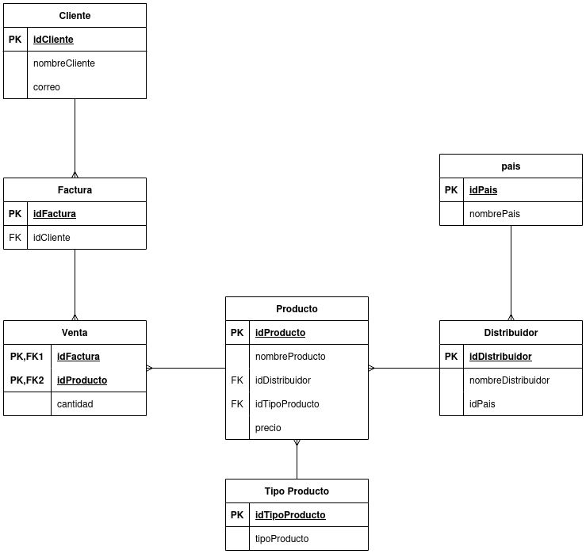

# Facturas-Ayudantia

Aquí se guardará el registro del ejemplo a llevar en varias clases de ayudantía del ejemplo de un sistema generico de facturas.



Se ejemplificará con el trabajo de instancias EC2, no obstante la gran mayoría de contenido es genérico MySQL, MariaDB y demás motores similares.

## Trabajo con instancias EC2

Se crea una instancia EC2 desde AWS, se recomienda usar micro pues la capa gratuita dura 1 hora y se puede borrar, reduciendo así los costos.

### SSH

Si se quiere trabajar desde el computador personal, se puede realizar una conexión via ssh que permite utilizar la terminal del equipo como si fuera la de la instancia.

Para esto al momento de crear la instancia se permite crear un par de claves, se recomienda usar .pem que permite usar ssh sin usar PUTTY necesariamente.

Al crear el archivo para conectarse se selecciona la opción cliente SSH en el entorno AWS que da el instructivo.

### Inicio de Configuración de entorno
Al iniciar la instancia por primera vez, se comienza **SIEMPRE** con:
 - `sudo apt update`
 - `sudo apt upgrade -y`

Se puede verificar que git esté instalado con `git --version`

Para instalar MySQL dentro de la instancia:

`sudo apt install mysql-server -y`

Al crearlo en la instancia no se configura automaticamente el usuario _root_, debido a esto se crea uno mediante la interfaz de MySQL. 

- Para abrir el MySQL sin usuario creado: `sudo mysql`
- Para crear usuario desde MYSQL `CREATE USER 'root'@'localhost' IDENTIFIED BY '<tu-clave>';`
- Para dar acceso a usuario: `GRANT ALL PRIVILEGES ON *.* TO 'root'@'localhost' WITH GRANT OPTION;`


### Comandos Básicos

- Ver bases de datos: `SHOW DATABASES;`
- Seleccionar una base de datos: `USE <nombreDB>;`
- Crear una base de datos: `CREATE DATABASE <nombreDB>;`
- Crear una tabla cuando se usa una base de datos: `CREATE TABLE <Nombre>;`
- Consulta general a una tabla `SELECT * FROM <NombreTabla>;`
- Ingresar registro a tabla `INSERT INTO <NombreTabla>(<Atributo1,Atributo2>) VALUES (ValorAtr1, ValorAtr2),(ValorAtr1, ValorAtr2);`
- Borrar registro `DELETE FROM <NombreTabla> WHERE <condicion>;`

## Instructivo implementación Modelo Factura

Para aplicar el modelo en este repositorio se requiere tener MySql o MariaDB instalado, desde la consola del motor se debe correr 

```
CREATE DATABASE facturas;
```

Y desde la consola de comandos ubicada en la carpeta, aplicar 

```
mysql -u root -p facturas < modelo.sql
```

Lo que ingresará el modelo en la base de datos creada.


Finalmente para poblar se puede utilizar un método como el explicado en clases, utilizando excel como se muestra en el archivo de este mismo repositorio, copiando y pegando en la consola del motor o en el workbench de coincidir.


Como implementación menos directa pero más personalizable se puede poblar las tablas maestras con cursores, se adjunta un ejemplo de la implementación en python, para aplicarlo se utilizó la versión 3.11 y con las librerias presentes en el archivo _requirements.txt_, se debe configurar la contraseña en el objeto conexion.

Finalmente para poblar la tabla transaccional existen muchos enfoques, pero uno muy común para archivos de muestra es generar una consulta que además inserte tomando datos al azar, de esta manera se puede uno assegurar de tener un set de datos que permitan generar pruebas y consultas complejas.